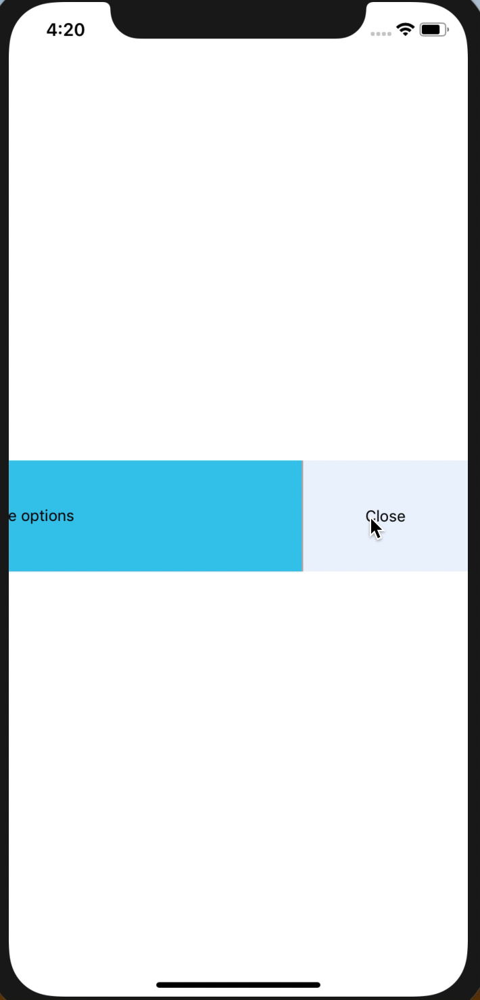

<div align="center">
	
</div>

# react-native-animated-item

[](https://npmjs.org/package/react-native-animated-item)
[](http://makeapullrequest.com)
[](https://github.com/pedreviljoen/react-native-animated-item/blob/master/LICENSE)
[](https://npmjs.org/package/react-native-animated-item) [](https://greenkeeper.io/)

> An animated item that slides open with some options. Useful in actionable lists.

## Contents

  - [Install](#install)
  - [Usage](#usage)
  - [Props](#props)
  - [Contribute](#contribute)
  - [License](#license)

## Install

```sh
yarn install react-native-animated-item
```

OR

```sh
npm install react-native-animated-item
```

## Usage

```javascript
import React from 'react'
import { View, Text, Image, StyleSheet } from 'react-native'
import AnimatedItem from 'react-native-animated-item'

class Example extends React.Component {
    onActionPress = () => console.log("You have clicked on the action option")

    render() {
        return(
            <View>
                <AnimatedItem
                    containerStyle={styles.main}
                    actionStyle={styles.actionContainer}
                    actionPress={this.onActionPress}
                    actionItem={ActionContent}
                >
                    <View>
                        <Text>
                            Some descriptive body
                        </Text>
                    </View>
                </AnimatedItem>
            </View>
        )
    }
}

const ActionContent = () => {
    return(
        <View>
            <Image source={'<some icon>'}/>
            <Text>
                Options
            </Text>
        </View>
    )
}

const styles = StyleSheet.create({
    main: {
        // some custom styling
    },
    actionContainer: {
        // some custom styling
    },
})
```

## Props

<table width="80%">
    <tr>
        <th>Property</th>
        <th>Description</th> 
        <th>Default Value</th>
    </tr>
    <tr>
        <td><code>containerStyle</code></td>
        <td>Styles of item container</td> 
        <td><code>{}</code></td>
    </tr>
    <tr>
        <td><code>actionStyle</code></td>
        <td>Styles of actionItem</td> 
        <td><code>{}</code></td>
    </tr>
    <tr>
        <td><code>actionPress</code></td>
        <td>Function to execute on click of actionItem</td> 
        <td><code>() => {}</code></td>
    </tr>
    <tr>
        <td><code>actionItem</code></td>
        <td>JSX component to display when slid open</td> 
        <td>Fallback component with text</td>
    </tr>
</table>

## Contribute

Contributions are welcome!

1. Fork it.
2. Create your feature branch: `git checkout -b my-new-feature`
3. Commit your changes: `git commit -am 'Add some feature'`
4. Push to the branch: `git push origin my-new-feature`
5. Submit a pull request :D

Or open up [a issue](https://github.com/pedreviljoen/react-native-animated-item/issues).

## License

MIT